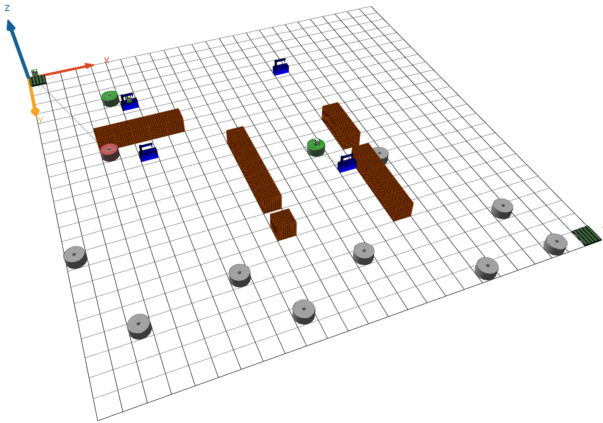

# Enabling Adaptation in Dynamic Manufacturing Environment with Decentralized Agent-Based Systems and Local Perception
These files are our online appendix for our paper "Enabling Adaptation in Dynamic Manufacturing Environment with Decentralized Agent-Based Systems and Local Perception" for SAC'2024 .

The goal is to investigate how decentralized agents can adapt in dynamic manufacturing environments, and to compare their performance to a centralized system. 
We use mobile agents based on our DALI approach as control system for a driverless transportation system. DALIs are situated in an environment that can change outside their perception, and have to fullfil transportation orders that obey external goals and have stricts requirements.

Fig. 1a - Initial setup for scenario A with source and sink on far ends of the shop floor| Fig. 1b - Initial setup for scenario B with source and sink near the center of the shop floor
:-------------------------:|:-------------------------:
 | 

 We simulate a dynamic shop floor (Fig. 2) that simulates the production of a modular smartphone. The products enter one after another at the source, have to be transported to specified work stations, and leave at the source. The 
shop floor contains distinct work stations (blue), transporters, a source and sink (green), and a varying amount of products, located on a discrete grid of floor tiles. Periphery (walls) represent obstacles.
Each station can hold at most one item, then it has to wait until a transporter picks up the item before another one is produced. Transporters can carry only one item at a time. 

The simulations have a built-in disturbance in their environment: The work stations may change their skills after pre-definde periodic time period. The disturbances shall be recognized and communicated by DALIs such that the transporters adapt to the changing environment.

We studied two scenarios:
- Scenario A: 12 transporters, 4 work stations, shop floor size 25x25, source and sink on far ends of the shop floor (cf. Fig 1a)
- Scenario B: 12 transporters, 4 work stations, shop floor size 25x25, source and sink near the center of the shop floor (cf. Fig 1b)

## Contents
includes/ - contains product lists and files describing the shop floor setups
- orderedItems\{50,100,250\}.csv : list of product with their defined stations they want to visit
- setup_smartphone*.csv : specifies where workstations, walls, source and sink are placed

models/
- CC.gaml : contains setup and behavior for central control of transporters
- DALI.gaml : contains behavior for  DALI control of transporters

models/environment/ : contains behavior of stations, products and shop floor

models/environment/images : contains images for 2D visualization

models/environment/objects : contains .obj files for 3D visualization (made with [figuro.io](https://www.figuro.io))

models/snapshots/ : pictures of the setups of the DALI system in action

simulation_result/ - contains measured data
-  Comparison-CC-DALI.ods : consolidated tables of all values with results per model, name indicates if Scenario A (= Sc1) or B (=Sc2) was applied. The tables indicate how many products were transported (\{50,100,250\}). Time periods of disturbances are given in the column "disturbance_cycle". 
- simulation_result/centralized/: contains .csv of measured data
- simulation_result/dali/: contains .csv of measured data

## Setup of the artifact for [GAMA](https://gama-platform.github.io/)

- Install GAMA according to these [steps](https://gama-platform.github.io/wiki/Installation)
  -  [System Requirements](https://gama-platform.github.io/wiki/Installation#system-requirements)
- [Import the project into your workspace](https://gama-platform.github.io/wiki/ImportingModels)
- Run the included experiments in /models/CC.gaml or /models/DALI.gaml:
  - "Fail_Safe_ShopFloor" and "Fail_Safe_ShopFloor_3D": run a simulation with a GUI, an animated shop floor, optionally in 3D
  - "Performance_centralised_no_outage" and "Performance_with_DALI": runs a batch of simulations to measure task performance and communication efficiency according to parameters
- Note that the simulation results are saved in separate files
